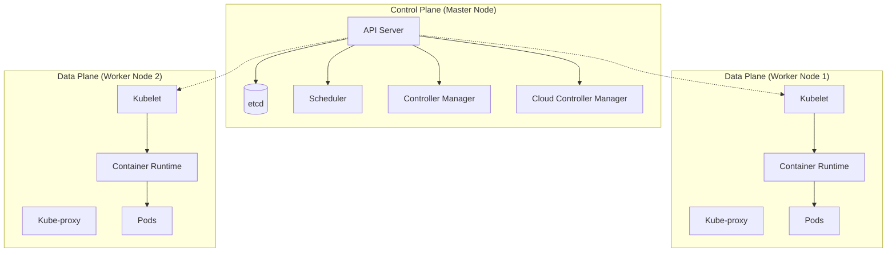
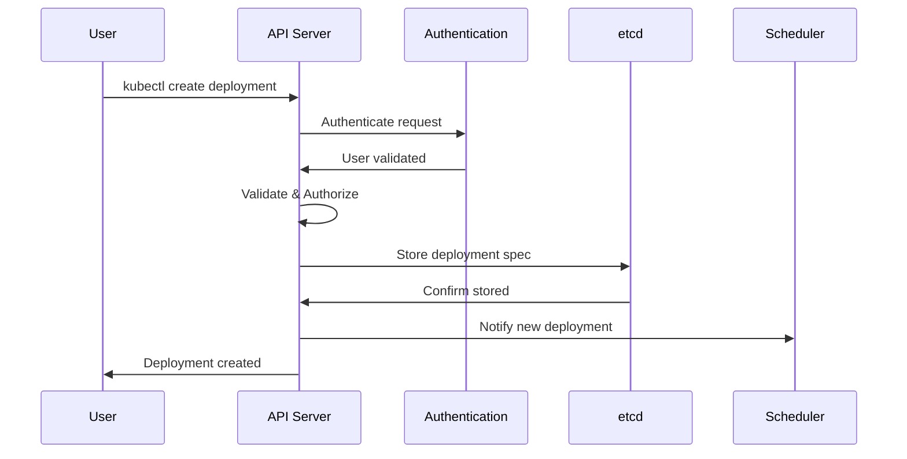
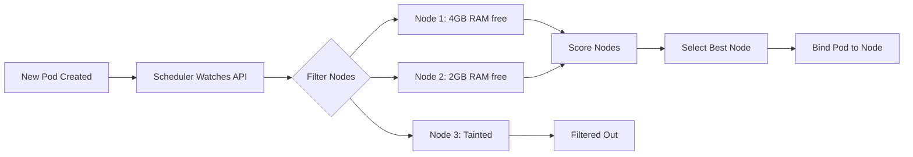
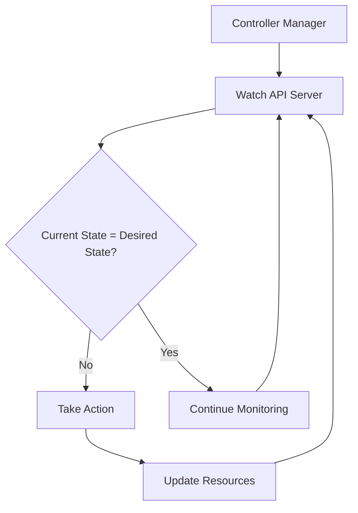
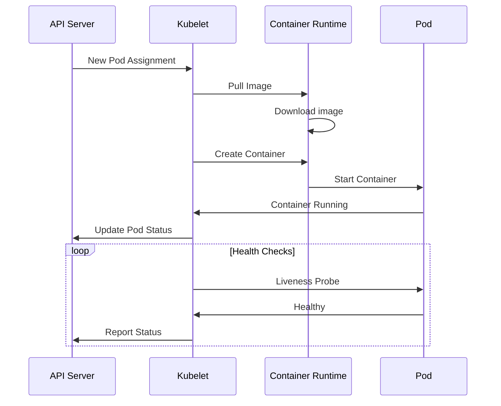
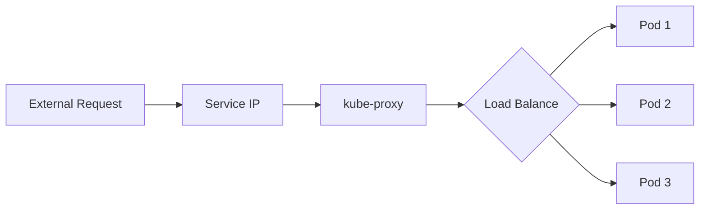
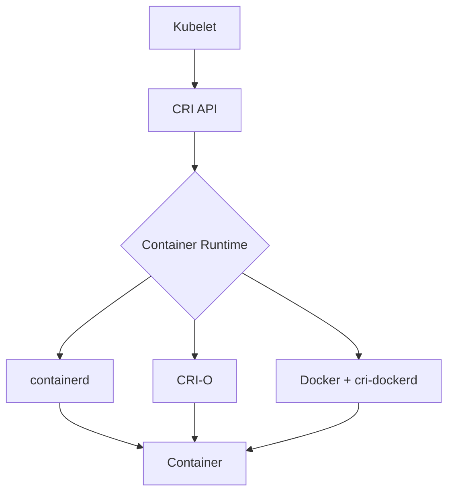
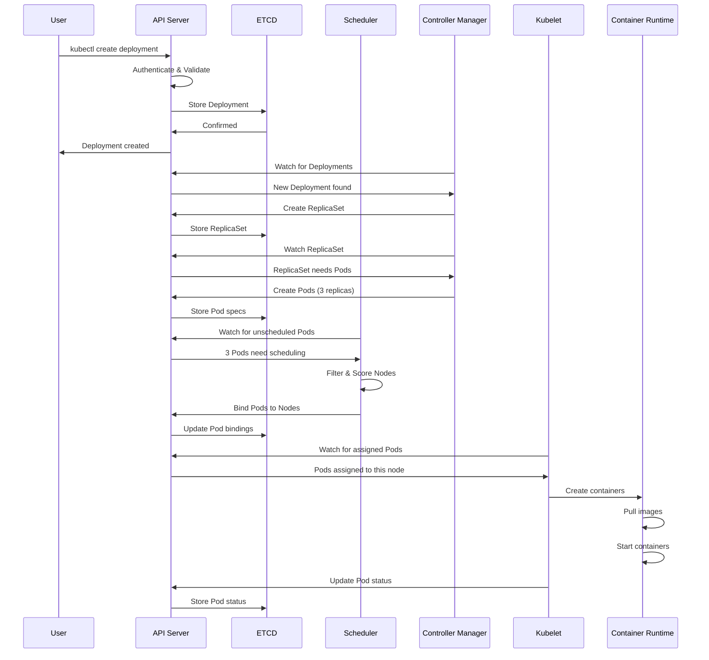

# Kubernetes (K8s) Learning Guide

A comprehensive, in-depth guide to understanding Kubernetes concepts for beginners and intermediate users.

---

## Table of Contents

1. [What is Kubernetes?](#what-is-kubernetes)
2. [Kubernetes Architecture Deep Dive](#kubernetes-architecture-deep-dive)
3. [Core Concepts](#core-concepts)
4. [Workload Resources](#workload-resources)
5. [Service & Networking](#service--networking)
6. [Configuration Management](#configuration-management)
7. [Kustomize](#kustomize)
8. [The Kubernetes API](#the-kubernetes-api)
9. [Common kubectl Commands](#common-kubectl-commands)
10. [Project Manifests Explained](#project-manifests-explained)
11. [Best Practices](#best-practices)

---

## What is Kubernetes?

### The Problem Kubernetes Solves

Before Kubernetes, deploying applications was challenging:

```
Traditional Deployment Problems:
┌─────────────────────────────────────────────────────────────────────┐
│                                                                     │
│  ❌ Manual scaling - Add servers by hand when traffic increases     │
│  ❌ Downtime during updates - Stop app, update, restart             │
│  ❌ No self-healing - If app crashes, someone must fix it manually  │
│  ❌ Inconsistent environments - "Works on my machine" syndrome      │
│  ❌ Complex load balancing - Managing traffic distribution          │
│                                                                     │
└─────────────────────────────────────────────────────────────────────┘
```

Kubernetes (K8s) is an open-source container orchestration platform that automates:

| Feature | Description | Example |
|---------|-------------|---------|
| **Deployment** | Rolling out containerized applications | Deploy new version without downtime |
| **Scaling** | Adjusting the number of running containers | Scale from 2 to 10 pods automatically |
| **Self-Healing** | Restarting failed containers | If a pod crashes, K8s creates a new one |
| **Load Balancing** | Distributing traffic across pods | Traffic evenly spread across 5 replicas |
| **Service Discovery** | Finding services by name | `curl http://my-service` instead of IP |
| **Configuration Management** | Centralizing app settings | ConfigMaps and Secrets |
| **Storage Orchestration** | Managing persistent data | Automatic volume provisioning |

### The Name "Kubernetes"

- **Origin**: Greek word "κυβερνήτης" meaning "helmsman" or "pilot"
- **K8s**: The "8" represents the 8 letters between "K" and "s" in "Kubernetes"
- **History**: Originally developed at Google, based on 15+ years of running production workloads

---

## Kubernetes Architecture Deep Dive

### High-Level Overview

```
┌─────────────────────────────────────────────────────────────────────────────┐
│                              KUBERNETES CLUSTER                             │
│                                                                             │
│  ┌────────────────────────────────────────────────────────────────────────┐ │
│  │                         CONTROL PLANE (Master)                         │ │
│  │                    "The Brain of the Cluster"                          │ │
│  │                                                                        │ │
│  │   ┌──────────────┐  ┌──────────────┐  ┌──────────────────────────────┐ │ │
│  │   │              │  │              │  │                              │ │ │
│  │   │  API Server  │  │    etcd      │  │     Controller Manager       │ │ │
│  │   │              │  │              │  │                              │ │ │
│  │   │  Front door  │  │  Database    │  │  Maintains desired state     │ │ │
│  │   │  for all     │  │  for all     │  │  Runs control loops          │ │ │
│  │   │  requests    │  │  cluster     │  │                              │ │ │
│  │   │              │  │  data        │  │  Controllers:                │ │ │
│  │   └──────┬───────┘  └──────────────┘  │  - Deployment Controller     │ │ │
│  │          │                            │  - ReplicaSet Controller     │ │ │
│  │          │                            │  - Node Controller           │ │ │
│  │          ▼                            │  - Service Controller        │ │ │
│  │   ┌──────────────┐                    └──────────────────────────────┘ │ │
│  │   │              │                                                     │ │
│  │   │  Scheduler   │  ◄─── Decides which node runs each pod              │ │
│  │   │              │                                                     │ │
│  │   └──────────────┘                                                     │ │
│  └────────────────────────────────────────────────────────────────────────┘ │
│                                      │                                      │
│                                      │ kubectl commands, pod scheduling     │
│                                      ▼                                      │
│  ┌────────────────────────────────────────────────────────────────────────┐ │
│  │                          WORKER NODES (Data Plane)                     │ │
│  │                      "Where your applications run"                     │ │
│  │                                                                        │ │
│  │   ┌──────────────────────────┐       ┌──────────────────────────┐      │ │
│  │   │        NODE 1            │       │        NODE 2            │      │ │
│  │   │                          │       │                          │      │ │
│  │   │  ┌────────────────────┐  │       │  ┌────────────────────┐  │      │ │
│  │   │  │      kubelet       │  │       │  │      kubelet       │  │      │ │
│  │   │  │  (Node Agent)      │  │       │  │  (Node Agent)      │  │      │ │
│  │   │  └────────────────────┘  │       │  └────────────────────┘  │      │ │
│  │   │                          │       │                          │      │ │
│  │   │  ┌────────────────────┐  │       │  ┌────────────────────┐  │      │ │
│  │   │  │    kube-proxy      │  │       │  │    kube-proxy      │  │      │ │
│  │   │  │  (Network Proxy)   │  │       │  │  (Network Proxy)   │  │      │ │
│  │   │  └────────────────────┘  │       │  └────────────────────┘  │      │ │
│  │   │                          │       │                          │      │ │
│  │   │  ┌────────────────────┐  │       │  ┌────────────────────┐  │      │ │
│  │   │  │  Container Runtime │  │       │  │  Container Runtime │  │      │ │
│  │   │  │  (containerd)      │  │       │  │  (containerd)      │  │      │ │
│  │   │  └────────────────────┘  │       │  └────────────────────┘  │      │ │
│  │   │                          │       │                          │      │ │
│  │   │  ┌─────┐ ┌─────┐ ┌─────┐ │       │  ┌─────┐ ┌─────┐         │      │ │
│  │   │  │Pod 1│ │Pod 2│ │Pod 3│ │       │  │Pod 4│ │Pod 5│         │      │ │
│  │   │  └─────┘ └─────┘ └─────┘ │       │  └─────┘ └─────┘         │      │ │
│  │   │                          │       │                          │      │ │
│  │   └──────────────────────────┘       └──────────────────────────┘      │ │
│  └────────────────────────────────────────────────────────────────────────┘ │
└─────────────────────────────────────────────────────────────────────────────┘
```

---

### Control Plane Components (In Detail)

The Control Plane is the "brain" of Kubernetes. It makes global decisions about the cluster and responds to cluster events.

#### 1. API Server (kube-apiserver)

**What it is:** The front door to Kubernetes. Every interaction with your cluster goes through the API Server.

**Responsibilities:**
- Validates and processes REST requests
- Updates the cluster state in etcd
- Serves as the hub for all cluster components
- Authenticates and authorizes all API requests

```
┌──────────────────────────────────────────────────────────────────┐
│                         API SERVER                               │
│                                                                  │
│   User/kubectl ─────┐                                            │
│                     │                                            │
│   CI/CD Pipeline ───┼──► Authentication ──► Authorization        │
│                     │         │                   │              │
│   Other Services ───┘         ▼                   ▼              │
│                        ┌─────────────┐    ┌─────────────┐        │
│                        │ Validate    │    │ Admission   │        │
│                        │ Request     │    │ Controllers │        │
│                        └──────┬──────┘    └──────┬──────┘        │
│                               │                   │              │
│                               ▼                   ▼              │
│                        ┌────────────────────────────────┐        │
│                        │    Write to etcd / Response    │        │
│                        └────────────────────────────────┘        │
└──────────────────────────────────────────────────────────────────┘
```

**Example Interaction:**
```bash
# When you run this command:
kubectl create deployment nginx --image=nginx

# Behind the scenes:
# 1. kubectl sends HTTPS request to API Server
# 2. API Server authenticates (who are you?)
# 3. API Server authorizes (can you do this?)
# 4. API Server validates the request
# 5. API Server stores the Deployment in etcd
# 6. API Server notifies relevant controllers
```

**Key Facts:**
- Runs on port 6443 (HTTPS)
- Stateless - can run multiple replicas for HA
- Only component that talks directly to etcd

---

#### 2. etcd

**What it is:** A distributed, consistent key-value store that stores ALL cluster data.

**Responsibilities:**
- Stores cluster state (deployments, pods, services, secrets, etc.)
- Provides strong consistency guarantees
- Maintains cluster configuration

```
┌─────────────────────────────────────────────────────────────────┐
│                            etcd                                 │
│                  "The Source of Truth"                          │
│                                                                 │
│   ┌──────────────────────────────────────────────────────────┐  │
│   │                    Key-Value Storage                     │  │
│   │                                                          │  │
│   │  /registry/deployments/default/nginx    → {Deployment}   │  │
│   │  /registry/pods/default/nginx-abc123    → {Pod spec}     │  │
│   │  /registry/services/default/nginx-svc   → {Service}      │  │
│   │  /registry/secrets/default/my-secret    → {encrypted}    │  │
│   │  /registry/configmaps/default/my-config → {data}         │  │
│   │  /registry/nodes/node-1                 → {Node info}    │  │
│   │                                                          │  │
│   └──────────────────────────────────────────────────────────┘  │
│                                                                 │
│   Features:                                                     │
│   ✓ Raft consensus (distributed agreement)                      │
│   ✓ Watch capability (notify on changes)                        │
│   ✓ MVCC (multi-version concurrency control)                    │
│   ✓ Data encryption at rest                                     │
└─────────────────────────────────────────────────────────────────┘
```

**Why it matters:**
- If etcd fails, you lose your cluster state
- Backup etcd regularly in production!
- etcd performance affects API Server performance

**Example stored data:**
```
Key: /registry/pods/fastapi-dev/fastapi-pod-xyz
Value: {
  "apiVersion": "v1",
  "kind": "Pod",
  "metadata": {
    "name": "fastapi-pod-xyz",
    "namespace": "fastapi-dev"
  },
  "spec": {
    "containers": [...]
  },
  "status": {
    "phase": "Running"
  }
}
```

---

#### 3. Scheduler (kube-scheduler)

**What it is:** Decides which node should run each new pod.

**Responsibilities:**
- Watches for newly created pods with no assigned node
- Selects the best node based on constraints and resources
- Writes the scheduling decision back to the API Server

```
┌─────────────────────────────────────────────────────────────────┐
│                        SCHEDULER                                │
│              "Where should this pod run?"                       │
│                                                                 │
│   New Pod Created ─────────────────────────────────────┐        │
│   (no node assigned)                                   │        │
│                                                        ▼        │
│                              ┌──────────────────────────────┐   │
│                              │     FILTERING (Predicates)   │   │
│                              │                              │   │
│                              │  Remove nodes that CAN'T run │   │
│                              │  the pod:                    │   │
│                              │                              │   │
│                              │  ✗ Not enough CPU/Memory     │   │
│                              │  ✗ Node is cordoned          │   │
│                              │  ✗ Taints don't match        │   │
│                              │  ✗ NodeSelector doesn't match│   │
│                              │  ✗ PodAffinity violated      │   │
│                              └───────────────┬──────────────┘   │
│                                              │                  │
│                                              ▼                  │
│                              ┌──────────────────────────────┐   │
│                              │      SCORING (Priorities)    │   │
│                              │                              │   │
│                              │  Rank remaining nodes:       │   │
│                              │                              │   │
│                              │  Node 1: 85 points           │   │
│                              │  Node 2: 92 points ◄── Winner│   │
│                              │  Node 3: 78 points           │   │
│                              │                              │   │
│                              │  Factors:                    │   │
│                              │  - Resource balance          │   │
│                              │  - Pod spreading             │   │
│                              │  - Affinity preferences      │   │
│                              └───────────────┬──────────────┘   │
│                                              │                  │
│                                              ▼                  │
│                              ┌──────────────────────────────┐   │
│                              │    BINDING (Schedule Pod)    │   │
│                              │                              │   │
│                              │  Update pod.spec.nodeName    │   │
│                              │  to "node-2"                 │   │
│                              └──────────────────────────────┘   │
└─────────────────────────────────────────────────────────────────┘
```

**Scheduling Factors:**
| Factor | Description |
|--------|-------------|
| **Resources** | Does the node have enough CPU/memory? |
| **Node Selector** | Does the pod require specific node labels? |
| **Taints/Tolerations** | Is the node tainted? Does the pod tolerate it? |
| **Affinity/Anti-affinity** | Should the pod be near/far from other pods? |
| **Pod Topology Spread** | Spread pods across zones/nodes |

---

#### 4. Controller Manager (kube-controller-manager)

**What it is:** Runs controller processes that regulate the cluster state.

**The Control Loop Pattern:**
Controllers continuously compare the *desired state* with the *actual state* and take action to reconcile them.

```
┌─────────────────────────────────────────────────────────────────┐
│                    CONTROL LOOP PATTERN                         │
│                                                                 │
│   ┌─────────────────────────────────────────────────────────┐   │
│   │                                                         │   │
│   │     ┌──────────────┐                                    │   │
│   │     │              │                                    │   │
│   │     │  OBSERVE     │ ◄─── Watch cluster state (via API) │   │
│   │     │              │                                    │   │
│   │     └──────┬───────┘                                    │   │
│   │            │                                            │   │
│   │            ▼                                            │   │
│   │     ┌──────────────┐                                    │   │
│   │     │              │                                    │   │
│   │     │  ANALYZE     │ ◄─── Compare desired vs actual     │   │
│   │     │              │                                    │   │
│   │     └──────┬───────┘                                    │   │
│   │            │                                            │   │
│   │            ▼  Different?                                │   │
│   │     ┌──────────────┐                                    │   │
│   │     │              │                                    │   │
│   │     │    ACT       │ ◄─── Take corrective action        │   │
│   │     │              │                                    │   │
│   │     └──────┬───────┘                                    │   │
│   │            │                                            │   │
│   │            └──────────────────────────────────────────► │   │
│   │                         Loop forever                    │   │
│   └─────────────────────────────────────────────────────────┘   │
└─────────────────────────────────────────────────────────────────┘
```

**Key Controllers:**

| Controller | What it Does |
|------------|--------------|
| **Deployment Controller** | Manages ReplicaSets based on Deployment specs. If you want 3 replicas, it ensures 3 exist. |
| **ReplicaSet Controller** | Ensures the correct number of pod replicas are running. Creates/deletes pods as needed. |
| **Node Controller** | Monitors node health. Marks nodes as unhealthy, evicts pods from failed nodes. |
| **Service Account Controller** | Creates default service accounts in new namespaces. |
| **Endpoint Controller** | Populates Endpoint objects (links Services to Pods). |
| **Namespace Controller** | Handles namespace deletion cleanup. |

**Example: Deployment Controller in Action**

```
SCENARIO: You have replicas: 3, but one pod crashes

Time 0:00 - Desired: 3 pods, Actual: 3 pods ✓
           Controller: "All good, nothing to do"

Time 0:01 - Pod crashes!
           Desired: 3 pods, Actual: 2 pods ✗

Time 0:02 - Controller notices the difference
           Action: "Create 1 new pod to reach desired state"

Time 0:03 - New pod is scheduled and starting
           Desired: 3 pods, Actual: 2 running + 1 pending

Time 0:05 - New pod is now running
           Desired: 3 pods, Actual: 3 pods ✓
           Controller: "All good again!"
```

---

### Worker Node Components (In Detail)

Worker nodes are where your application containers actually run.

#### 1. kubelet

**What it is:** The primary node agent that runs on every worker node.

**Responsibilities:**
- Registers the node with the cluster
- Watches for pod assignments from the API Server
- Ensures containers are running as specified
- Reports node and pod status back to control plane
- Executes liveness/readiness probes

```
┌─────────────────────────────────────────────────────────────────┐
│                          kubelet                                │
│                    "The Node Agent"                             │
│                                                                 │
│   ┌─────────────────────────────────────────────────────────┐   │
│   │                                                         │   │
│   │   1. WATCH API Server for pods assigned to this node    │   │
│   │                           │                             │   │
│   │                           ▼                             │   │
│   │   2. TRANSLATE pod spec to container runtime commands   │   │
│   │                           │                             │   │
│   │                           ▼                             │   │
│   │   3. MANAGE containers via Container Runtime Interface  │   │
│   │      (CRI) - create, start, stop, delete containers     │   │
│   │                           │                             │   │
│   │                           ▼                             │   │
│   │   4. MONITOR containers - run probes, check health      │   │
│   │                           │                             │   │
│   │                           ▼                             │   │
│   │   5. REPORT status back to API Server                   │   │
│   │                                                         │   │
│   └─────────────────────────────────────────────────────────┘   │
│                                                                 │
│   kubelet ◄──► Container Runtime (containerd/CRI-O)             │
│              │                                                  │
│              └──► Actual containers on the node                 │
└─────────────────────────────────────────────────────────────────┘
```

**What happens when a pod is scheduled to a node:**
```
1. API Server notifies kubelet: "Run this pod"
2. kubelet reads pod spec
3. kubelet pulls container images
4. kubelet tells container runtime to create containers
5. kubelet starts containers
6. kubelet runs probes (liveness/readiness)
7. kubelet reports "Pod Running" to API Server
```

---

#### 2. kube-proxy

**What it is:** Network proxy that runs on each node, implementing Kubernetes Service concepts.

**Responsibilities:**
- Maintains network rules on nodes
- Enables network communication to pods from inside/outside
- Implements service abstraction (stable IP for dynamic pods)

```
┌─────────────────────────────────────────────────────────────────┐
│                        kube-proxy                               │
│              "The Network Rules Manager"                        │
│                                                                 │
│   SERVICE: fastapi-service (ClusterIP: 10.96.45.67)             │
│            ↓ routes to ↓                                        │
│   PODS: 10.244.1.5, 10.244.2.8, 10.244.1.9                      │
│                                                                 │
│   ┌─────────────────────────────────────────────────────────┐   │
│   │                                                         │   │
│   │   Traffic to 10.96.45.67:80 (Service IP)                │   │
│   │                   │                                     │   │
│   │                   ▼                                     │   │
│   │   kube-proxy intercepts (via iptables/IPVS)             │   │
│   │                   │                                     │   │
│   │                   ▼                                     │   │
│   │   Load balance to one of:                               │   │
│   │     ├── 10.244.1.5:8000 (Pod 1)                         │   │
│   │     ├── 10.244.2.8:8000 (Pod 2)                         │   │
│   │     └── 10.244.1.9:8000 (Pod 3)                         │   │
│   │                                                         │   │
│   └─────────────────────────────────────────────────────────┘   │
│                                                                 │
│   Modes:                                                        │
│   • iptables (default) - Linux netfilter rules                  │
│   • IPVS - Linux IP Virtual Server (better performance)         │
│   • userspace (legacy) - proxy in user space                    │
└─────────────────────────────────────────────────────────────────┘
```

**Why kube-proxy matters:**
- Pods are ephemeral - their IPs change
- Services provide stable IPs
- kube-proxy makes this magic happen by updating network rules

---

#### 3. Container Runtime

**What it is:** Software responsible for running containers.

**Common Container Runtimes:**
| Runtime | Description |
|---------|-------------|
| **containerd** | Industry-standard, used by EKS, GKE, most clouds |
| **CRI-O** | Lightweight, designed specifically for Kubernetes |
| **Docker** | Deprecated in K8s 1.24+ (but Docker images still work!) |

```
┌─────────────────────────────────────────────────────────────────┐
│                  Container Runtime Interface (CRI)              │
│                                                                 │
│   kubelet ────► CRI ────► containerd ────► Containers           │
│                                                                 │
│   Operations:                                                   │
│   • PullImage     - Download container image                    │
│   • CreateContainer - Set up container                          │
│   • StartContainer  - Run the container                         │
│   • StopContainer   - Gracefully stop                           │
│   • RemoveContainer - Delete container                          │
│   • ContainerStatus - Check if running                          │
└─────────────────────────────────────────────────────────────────┘
```

---

## Core Concepts

### 1. Pod (In Detail)

The **smallest deployable unit** in Kubernetes. A pod represents a single instance of a running process.

```
┌─────────────────────────────────────────────────────────────────┐
│                            POD                                  │
│                                                                 │
│   ┌─────────────────────────────────────────────────────────┐   │
│   │                   Pod Specification                     │   │
│   │                                                         │   │
│   │   • Name: fastapi-pod-abc123                            │   │
│   │   • Namespace: fastapi-dev                              │   │
│   │   • IP Address: 10.244.1.5 (assigned by cluster)        │   │
│   │                                                         │   │
│   │   ┌──────────────┐  ┌──────────────┐                    │   │
│   │   │ Container 1  │  │ Container 2  │  (sidecar)         │   │
│   │   │              │  │              │                    │   │
│   │   │ fastapi:v1   │  │ fluentd:v1   │  (optional)        │   │
│   │   │ Port: 8000   │  │              │                    │   │
│   │   └──────────────┘  └──────────────┘                    │   │
│   │          │                  │                           │   │
│   │          └────────┬─────────┘                           │   │
│   │                   │                                     │   │
│   │   ┌───────────────▼────────────────┐                    │   │
│   │   │       Shared Resources         │                    │   │
│   │   │                                │                    │   │
│   │   │  • Network namespace (same IP) │                    │   │
│   │   │  • Storage volumes             │                    │   │
│   │   │  • IPC namespace               │                    │   │
│   │   └────────────────────────────────┘                    │   │
│   │                                                         │   │
│   └─────────────────────────────────────────────────────────┘   │
└─────────────────────────────────────────────────────────────────┘
```

**Pod YAML Example with Explanations:**

```yaml
apiVersion: v1              # API version to use
kind: Pod                   # Type of resource
metadata:
  name: my-pod              # Pod name (must be unique in namespace)
  namespace: default        # Which namespace
  labels:                   # Key-value pairs for organization
    app: fastapi
    version: v1
spec:
  containers:               # List of containers in this pod
    - name: fastapi         # Container name
      image: nginx:1.21     # Docker image to use
      ports:
        - containerPort: 80 # Port the container listens on
      env:                  # Environment variables
        - name: DB_HOST
          value: "postgres"
      resources:            # Resource management
        requests:           # Guaranteed resources
          cpu: "100m"
          memory: "128Mi"
        limits:             # Maximum resources
          cpu: "500m"
          memory: "256Mi"
  restartPolicy: Always     # What to do if container exits
```

**Pod Lifecycle:**

```
┌─────────┐    ┌─────────┐    ┌─────────┐    ┌───────────┐
│ Pending │ ──►│ Running │ ──►│Succeeded│ OR │  Failed   │
└─────────┘    └─────────┘    └─────────┘    └───────────┘
     │              │
     │              └── Container crashes → Restart (if Always)
     │
     └── Waiting for scheduling or image pull
```

| Phase | Description |
|-------|-------------|
| **Pending** | Pod accepted, but containers not running yet |
| **Running** | At least one container is running |
| **Succeeded** | All containers terminated successfully |
| **Failed** | At least one container failed |
| **Unknown** | Pod state cannot be determined |

**Multi-Container Pod Patterns:**

| Pattern | Use Case | Example |
|---------|----------|---------|
| **Sidecar** | Add functionality to main container | Log collector, monitoring agent |
| **Ambassador** | Proxy to external services | Database proxy |
| **Adapter** | Transform output of main container | Log format converter |

---

### 2. Namespace (In Detail)

Namespaces provide **logical isolation** within a cluster.

```
┌─────────────────────────────────────────────────────────────────┐
│                      KUBERNETES CLUSTER                         │
│                                                                 │
│   ┌────────────────────┐  ┌────────────────────┐                │
│   │   Namespace: dev   │  │  Namespace: prod   │                │
│   │                    │  │                    │                │
│   │  ┌─────────────┐   │  │  ┌─────────────┐   │                │
│   │  │ Deployment  │   │  │  │ Deployment  │   │                │
│   │  │ fastapi     │   │  │  │ fastapi     │   │                │
│   │  │ replicas: 1 │   │  │  │ replicas: 5 │   │                │
│   │  └─────────────┘   │  │  └─────────────┘   │                │
│   │                    │  │                    │                │
│   │  ┌─────────────┐   │  │  ┌─────────────┐   │                │
│   │  │  Service    │   │  │  │  Service    │   │                │
│   │  │  fastapi    │   │  │  │  fastapi    │   │                │
│   │  └─────────────┘   │  │  └─────────────┘   │                │
│   │                    │  │                    │                │
│   │  ResourceQuota:    │  │  ResourceQuota:    │                │
│   │   CPU: 2 cores     │  │   CPU: 20 cores    │                │
│   │   Mem: 4Gi         │  │   Mem: 64Gi        │                │
│   │                    │  │                    │                │
│   └────────────────────┘  └────────────────────┘                │
│                                                                 │
│   ┌────────────────────────────────────────────────────────┐    │
│   │                  Namespace: kube-system                │    │
│   │           (System components - DO NOT MODIFY)          │    │
│   │                                                        │    │
│   │  coredns, kube-proxy, aws-node, metrics-server, etc.   │    │
│   └────────────────────────────────────────────────────────┘    │
└─────────────────────────────────────────────────────────────────┘
```

**Default Namespaces Explained:**

| Namespace | Purpose | Can You Use It? |
|-----------|---------|-----------------|
| `default` | Where resources go if you don't specify a namespace | Yes, but not recommended for production |
| `kube-system` | Kubernetes system components (DNS, proxy, etc.) | Don't modify! |
| `kube-public` | Publicly readable resources (rarely used) | Generally leave alone |
| `kube-node-lease` | Node heartbeat data | Don't modify! |

**What Namespaces Provide:**
- Resource isolation
- Access control (RBAC per namespace)
- Resource quotas (limit CPU/memory per namespace)
- Network policies (control traffic between namespaces)

**What Namespaces DON'T Provide:**
- Node isolation (pods still share nodes)
- Security isolation (use Pod Security Policies for that)

---

### 3. Labels and Selectors (In Detail)

Labels are the **primary grouping mechanism** in Kubernetes.

```yaml
# Adding labels to a resource
metadata:
  labels:
    app: fastapi            # Application name
    environment: production # Environment
    version: v2.1.0         # Version
    team: backend           # Owning team
    tier: api               # Application tier
```

**Selector Types:**

```yaml
# Equality-based (exact match)
selector:
  matchLabels:
    app: fastapi
    environment: prod

# Set-based (more flexible)
selector:
  matchExpressions:
    - key: environment
      operator: In
      values: [prod, staging]
    - key: version
      operator: NotIn
      values: [v1.0.0]
    - key: feature-flag
      operator: Exists
```

**How Selectors Work:**

```
┌─────────────────────────────────────────────────────────────────┐
│                         SERVICE                                 │
│   selector:                                                     │
│     app: fastapi                                                │
│     environment: prod                                           │
│                            │                                    │
│                            │ "Find all pods with these labels"  │
│                            ▼                                    │
│   ┌─────────┬─────────┬─────────┬─────────┬─────────┐           │
│   │ Pod A   │ Pod B   │ Pod C   │ Pod D   │ Pod E   │           │
│   │app:     │app:     │app:     │app:     │app:     │           │
│   │fastapi  │fastapi  │nginx    │fastapi  │fastapi  │           │
│   │env:     │env:     │env:     │env:     │env:     │           │
│   │prod     │dev      │prod     │prod     │prod     │           │
│   │         │         │         │         │         │           │
│   │   ✓     │   ✗     │   ✗     │   ✓     │   ✓     │           │
│   │ MATCH   │NO MATCH │NO MATCH │ MATCH   │ MATCH   │           │
│   └─────────┴─────────┴─────────┴─────────┴─────────┘           │
│                                                                 │
│   Service routes traffic only to: Pod A, Pod D, Pod E           │
└─────────────────────────────────────────────────────────────────┘
```

---

## Workload Resources

### Deployment (In Detail)

A Deployment provides **declarative updates** for Pods and ReplicaSets.

**Hierarchy:**
```
Deployment
    │
    │ manages
    ▼
ReplicaSet (current)
    │
    │ maintains
    ▼
Pods (actual running instances)
    
        +
    
ReplicaSet (previous) ◄── Kept for rollback
```

**Rolling Update Process:**

```
STEP 1: Initial State
┌────────────────────────────────────────────┐
│ ReplicaSet v1 (desired: 3, current: 3)     │
│ ┌─────┐ ┌─────┐ ┌─────┐                    │
│ │Pod 1│ │Pod 2│ │Pod 3│     Image: v1.0    │
│ └─────┘ └─────┘ └─────┘                    │
└────────────────────────────────────────────┘

STEP 2: Update triggered (new image: v2.0)
┌────────────────────────────────────────────┐
│ ReplicaSet v1 (desired: 2, current: 3)     │
│ ┌─────┐ ┌─────┐ ┌─────┐                    │
│ │Pod 1│ │Pod 2│ │Pod 3│     Scaling down   │
│ └─────┘ └─────┘ └TERM─┘                    │
│                                            │
│ ReplicaSet v2 (desired: 1, current: 0)     │
│ ┌─────┐                                    │
│ │ NEW │              Creating...           │
│ └─────┘                                    │
└────────────────────────────────────────────┘

STEP 3: Gradual transition
┌────────────────────────────────────────────┐
│ ReplicaSet v1 (desired: 1, current: 2)     │
│ ┌─────┐ ┌─────┐                            │
│ │Pod 1│ │Pod 2│             Scaling down   │
│ └─────┘ └TERM─┘                            │
│                                            │
│ ReplicaSet v2 (desired: 2, current: 1)     │
│ ┌─────┐ ┌─────┐                            │
│ │Pod 4│ │ NEW │             Scaling up     │
│ └─────┘ └─────┘                            │
└────────────────────────────────────────────┘

STEP 4: Complete
┌────────────────────────────────────────────┐
│ ReplicaSet v1 (desired: 0, current: 0)     │
│ (Kept for rollback, no pods)               │
│                                            │
│ ReplicaSet v2 (desired: 3, current: 3)     │
│ ┌─────┐ ┌─────┐ ┌─────┐                    │
│ │Pod 4│ │Pod 5│ │Pod 6│    All v2.0 now!   │
│ └─────┘ └─────┘ └─────┘                    │
└────────────────────────────────────────────┘
```

**Deployment Strategy Options:**

```yaml
spec:
  strategy:
    type: RollingUpdate       # or "Recreate"
    rollingUpdate:
      maxUnavailable: 1       # Max pods that can be unavailable
      maxSurge: 1             # Max extra pods during update
```

| Strategy | Description | Use Case |
|----------|-------------|----------|
| **RollingUpdate** | Gradually replace pods | Zero-downtime updates (default) |
| **Recreate** | Kill all, then create new | When you can't run mixed versions |

---

### Health Checks (Probes) - Deep Dive

```
┌─────────────────────────────────────────────────────────────────┐
│                      PROBE TYPES                                │
│                                                                 │
│   ┌───────────────┐   ┌───────────────┐   ┌───────────────┐     │
│   │   LIVENESS    │   │  READINESS    │   │   STARTUP     │     │
│   │               │   │               │   │               │     │
│   │ "Is it alive?"│   │"Is it ready?" │   │"Has it started│     │
│   │               │   │               │   │ successfully?"│     │
│   │ If NO:        │   │ If NO:        │   │               │     │
│   │ RESTART       │   │ Remove from   │   │ If NO:        │     │
│   │ CONTAINER     │   │ service       │   │ RESTART       │     │
│   │               │   │ endpoints     │   │               │     │
│   └───────────────┘   └───────────────┘   └───────────────┘     │
└─────────────────────────────────────────────────────────────────┘
```

**Probe Configuration Explained:**

```yaml
livenessProbe:
  httpGet:
    path: /health           # Endpoint to check
    port: 8000              # Port to check on
    httpHeaders:            # Optional headers
      - name: Custom-Header
        value: Awesome
  initialDelaySeconds: 10   # Wait 10s before first probe
  periodSeconds: 10         # Probe every 10 seconds
  timeoutSeconds: 5         # Probe times out after 5s
  failureThreshold: 3       # Fail after 3 consecutive failures
  successThreshold: 1       # Succeed after 1 success
```

**Timeline Example:**

```
0s    Container starts
      |
10s   First liveness probe (initialDelaySeconds: 10)
      |
      ▼
      Probe 1: HTTP GET /health → 200 OK ✓
      |
20s   Probe 2: HTTP GET /health → 200 OK ✓
      |
30s   Probe 3: HTTP GET /health → 500 Error ✗ (failure 1)
      |
40s   Probe 4: HTTP GET /health → 500 Error ✗ (failure 2)
      |
50s   Probe 5: HTTP GET /health → 500 Error ✗ (failure 3)
      |
      ▼
      CONTAINER RESTARTED! (failureThreshold: 3 reached)
```

---

## Service & Networking

### Service Types (Deep Dive)

```
┌─────────────────────────────────────────────────────────────────┐
│                     SERVICE TYPES COMPARISON                    │
│                                                                 │
│   CLUSTERIP (Default)                                           │
│   ┌─────────────────────────────────────────────────────────┐   │
│   │ • Only accessible within the cluster                    │   │
│   │ • Gets a stable internal IP (e.g., 10.96.45.67)         │   │
│   │ • No external access                                    │   │
│   │ • Use: Internal microservices communication             │   │
│   │                                                         │   │
│   │   [Pod A] ──► ClusterIP:80 ──► [Pod B, Pod C, Pod D]    │   │
│   └─────────────────────────────────────────────────────────┘   │
│                                                                 │
│   NODEPORT                                                      │
│   ┌─────────────────────────────────────────────────────────┐   │
│   │ • Exposes service on each node's IP at a static port    │   │
│   │ • Port range: 30000-32767                               │   │
│   │ • Access: <NodeIP>:<NodePort>                           │   │
│   │ • Use: Development, debugging                           │   │
│   │                                                         │   │
│   │   Internet ──► Node1:30080 ──► Service ──► Pods         │   │
│   │             ──► Node2:30080 ──►                         │   │
│   └─────────────────────────────────────────────────────────┘   │
│                                                                 │
│   LOADBALANCER                                                  │
│   ┌─────────────────────────────────────────────────────────┐   │
│   │ • Creates external load balancer (cloud-specific)       │   │
│   │ • Gets public IP from cloud provider                    │   │
│   │ • Use: Production traffic                               │   │
│   │                                                         │   │
│   │   Internet ──► AWS ALB/NLB ──► Service ──► Pods         │   │
│   │                (Public IP)                              │   │
│   └─────────────────────────────────────────────────────────┘   │
│                                                                 │
│   EXTERNALNAME                                                  │
│   ┌─────────────────────────────────────────────────────────┐   │
│   │ • Maps service to external DNS name                     │   │
│   │ • No proxying, just DNS CNAME record                    │   │
│   │ • Use: Reference external services                      │   │
│   │                                                         │   │
│   │   [Pod] ──► my-db-service ──► external-db.example.com   │   │
│   └─────────────────────────────────────────────────────────┘   │
└─────────────────────────────────────────────────────────────────┘
```

**Port Forward (Development Access):**

```bash
# Forward local port 8000 to service port 80
kubectl port-forward service/fastapi-service 8000:80 -n fastapi-dev

# What happens:
# localhost:8000 ──► kubectl tunnel ──► Service:80 ──► Pod:8000
```

---

## Configuration Management

### ConfigMap vs Secret

```
┌─────────────────────────────────────────────────────────────────┐
│               CONFIGMAP vs SECRET                               │
│                                                                 │
│   ┌─────────────────────────┐   ┌─────────────────────────┐     │
│   │       CONFIGMAP         │   │         SECRET          │     │
│   │                         │   │                         │     │
│   │  • Non-sensitive data   │   │  • Sensitive data       │     │
│   │  • Plain text           │   │  • Base64 encoded       │     │
│   │  • No encryption        │   │  • Optional encryption  │     │
│   │                         │   │    (EncryptionConfig)   │     │
│   │  Examples:              │   │                         │     │
│   │  - Feature flags        │   │  Examples:              │     │
│   │  - Config files         │   │  - Passwords            │     │
│   │  - Environment URLs     │   │  - API keys             │     │
│   │  - Log levels           │   │  - TLS certificates     │     │
│   │                         │   │  - SSH keys             │     │
│   └─────────────────────────┘   └─────────────────────────┘     │
└─────────────────────────────────────────────────────────────────┘
```

**Ways to Use ConfigMaps/Secrets:**

```yaml
# Method 1: As environment variables
env:
  - name: DATABASE_URL
    valueFrom:
      configMapKeyRef:
        name: app-config
        key: DATABASE_URL

# Method 2: As volume mount (files)
volumes:
  - name: config-volume
    configMap:
      name: app-config
volumeMounts:
  - name: config-volume
    mountPath: /etc/config

# Method 3: All keys as environment variables
envFrom:
  - configMapRef:
      name: app-config
```

---

## Kustomize

### Why Kustomize?

```
WITHOUT Kustomize:
┌───────────────────────────────────────────────────────────┐
│                                                           │
│   deployment-dev.yaml   ◄── Copy of deployment            │
│   deployment-test.yaml  ◄── Copy with small changes       │
│   deployment-prod.yaml  ◄── Copy with different changes   │
│                                                           │
│   Problems:                                               │
│   • Duplicate code                                        │
│   • Easy to miss updates                                  │
│   • Hard to maintain                                      │
└───────────────────────────────────────────────────────────┘

WITH Kustomize:
┌───────────────────────────────────────────────────────────┐
│                                                           │
│   base/                                                   │
│   └── deployment.yaml   ◄── Single source of truth        │
│                                                           │
│   overlays/                                               │
│   ├── dev/              ◄── Only the differences          │
│   ├── test/             ◄── Only the differences          │
│   └── prod/             ◄── Only the differences          │
│                                                           │
│   Benefits:                                               │
│   • DRY (Don't Repeat Yourself)                           │
│   • Easy to maintain                                      │
│   • Git-friendly                                          │
└───────────────────────────────────────────────────────────┘
```

---

## The Kubernetes API

### Manifest Structure

Every Kubernetes manifest follows this structure:

```yaml
apiVersion: <group>/<version>   # Which API to use
kind: <resource-type>           # What to create
metadata:                       # Identification
  name: <name>
  namespace: <namespace>
  labels: <labels>
  annotations: <annotations>
spec:                           # Desired state
  <resource-specific-fields>
status:                         # Actual state (read-only)
  <managed-by-kubernetes>
```

**Common API Groups:**

| API Version | Resources |
|-------------|-----------|
| `v1` | Pod, Service, ConfigMap, Secret, Namespace |
| `apps/v1` | Deployment, ReplicaSet, StatefulSet, DaemonSet |
| `batch/v1` | Job, CronJob |
| `networking.k8s.io/v1` | Ingress, NetworkPolicy |
| `rbac.authorization.k8s.io/v1` | Role, ClusterRole, RoleBinding |

---

## Common kubectl Commands

### Quick Reference

```bash
# ─────────────────────────────────────────────────────────────────
# CLUSTER & NODES
# ─────────────────────────────────────────────────────────────────
kubectl cluster-info                    # Cluster info
kubectl get nodes                       # List nodes
kubectl describe node <name>            # Node details
kubectl top nodes                       # Node resource usage

# ─────────────────────────────────────────────────────────────────
# PODS
# ─────────────────────────────────────────────────────────────────
kubectl get pods                        # List pods (default ns)
kubectl get pods -n <namespace>         # List pods in namespace
kubectl get pods -A                     # All namespaces
kubectl get pods -o wide                # More details (node, IP)
kubectl get pods -w                     # Watch for changes

kubectl describe pod <name>             # Full details
kubectl logs <pod>                      # View logs
kubectl logs <pod> -f                   # Follow logs
kubectl logs <pod> -c <container>       # Specific container
kubectl logs <pod> --previous           # Previous container logs

kubectl exec -it <pod> -- /bin/sh       # Shell into pod
kubectl exec <pod> -- <command>         # Run command

kubectl delete pod <name>               # Delete pod
kubectl delete pod <name> --force       # Force delete

# ─────────────────────────────────────────────────────────────────
# DEPLOYMENTS
# ─────────────────────────────────────────────────────────────────
kubectl get deployments                 # List deployments
kubectl describe deployment <name>     # Deployment details

kubectl scale deployment <name> --replicas=5    # Scale
kubectl set image deployment/<name> <container>=<image>  # Update image

kubectl rollout status deployment/<name>       # Watch rollout
kubectl rollout history deployment/<name>      # Rollout history
kubectl rollout undo deployment/<name>         # Rollback
kubectl rollout undo deployment/<name> --to-revision=2  # Specific

kubectl rollout restart deployment/<name>      # Restart all pods

# ─────────────────────────────────────────────────────────────────
# SERVICES
# ─────────────────────────────────────────────────────────────────
kubectl get services                    # List services
kubectl describe service <name>         # Service details
kubectl port-forward service/<name> 8000:80  # Local access

# ─────────────────────────────────────────────────────────────────
# DEBUGGING
# ─────────────────────────────────────────────────────────────────
kubectl get events --sort-by=.lastTimestamp  # Recent events
kubectl top pods                        # Pod resource usage
kubectl run debug --rm -it --image=busybox -- /bin/sh  # Debug pod

# ─────────────────────────────────────────────────────────────────
# APPLY & DELETE
# ─────────────────────────────────────────────────────────────────
kubectl apply -f <file.yaml>            # Apply manifest
kubectl apply -k <kustomization-dir>    # Apply Kustomization
kubectl delete -f <file.yaml>           # Delete from manifest
kubectl delete -k <kustomization-dir>   # Delete Kustomization
kubectl diff -f <file.yaml>             # Preview changes
```

---

## Project Manifests Explained

See the actual manifest files in `k8s/` directory with detailed inline comments.

---

## Best Practices

### 1. Resource Management
```yaml
# ALWAYS set resource limits to prevent noisy neighbors
resources:
  requests:
    cpu: "100m"         # What you expect to use
    memory: "128Mi"
  limits:
    cpu: "500m"         # Maximum allowed
    memory: "256Mi"     # OOMKilled if exceeded
```

### 2. Health Probes
```yaml
# ALWAYS add probes for production
livenessProbe:          # Restart if unhealthy
  httpGet:
    path: /health
    port: 8000
readinessProbe:         # Don't send traffic if not ready
  httpGet:
    path: /health
    port: 8000
```

### 3. Labels
```yaml
# Use consistent, meaningful labels
labels:
  app.kubernetes.io/name: fastapi
  app.kubernetes.io/version: "1.0.0"
  app.kubernetes.io/component: api
  app.kubernetes.io/part-of: my-application
  app.kubernetes.io/managed-by: kustomize
```

### 4. Security
```yaml
# Run as non-root
securityContext:
  runAsNonRoot: true
  runAsUser: 1000
  readOnlyRootFilesystem: true
```

### 5. Use Namespaces
```bash
# Separate environments
kubectl create namespace dev
kubectl create namespace staging
kubectl create namespace prod
```

---

## Kubernetes Control Plane & Data Plane Components

### Overview

Kubernetes architecture is divided into two main planes:
- **Control Plane**: The brain of the cluster that makes global decisions
- **Data Plane**: Worker nodes that run your actual applications



---

### Control Plane Components

The Control Plane manages the Kubernetes cluster and makes decisions about scheduling, detecting/responding to cluster events, and maintaining desired state.

#### 1. API Server (kube-apiserver)

**Function**: The front-end of the Kubernetes control plane. It's the only component that directly interacts with etcd and serves as the gateway for all REST commands used to control the cluster.

**How It Works**:
- Validates and processes REST requests
- Authenticates and authorizes users
- Updates the state in etcd
- Acts as the central hub for all cluster communication

**Example Flow**:


**Bash Commands**:
```bash
# Check API server status
kubectl cluster-info

# View API server logs (if you have access to master node)
sudo journalctl -u kube-apiserver

# Check API server pod in kube-system namespace
kubectl get pods -n kube-system | grep kube-apiserver

# Get API server details
kubectl get pods -n kube-system kube-apiserver-<node-name> -o yaml

# Test API server connectivity
kubectl get --raw /healthz

# View all API resources
kubectl api-resources

# Check API versions
kubectl api-versions
```

---

#### 2. etcd

**Function**: A distributed, consistent key-value store that stores all cluster data, including configuration, state, and metadata. It's the single source of truth for the cluster.

**How It Works**:
- Stores cluster state in key-value pairs
- Uses Raft consensus algorithm for distributed consistency
- Only the API server reads/writes to etcd
- Supports watch operations for real-time updates

**Data Stored**:
- Pods, Services, ConfigMaps, Secrets
- Network policies, Namespaces
- Cluster state and metadata

**Bash Commands**:
```bash
# Check etcd pod status
kubectl get pods -n kube-system | grep etcd

# View etcd pod details
kubectl describe pod -n kube-system etcd-<node-name>

# Access etcd (if running as pod)
kubectl exec -n kube-system etcd-<node-name> -- etcdctl version

# Backup etcd (important!)
ETCDCTL_API=3 etcdctl snapshot save /backup/etcd-snapshot.db \
  --endpoints=https://127.0.0.1:2379 \
  --cacert=/etc/kubernetes/pki/etcd/ca.crt \
  --cert=/etc/kubernetes/pki/etcd/server.crt \
  --key=/etc/kubernetes/pki/etcd/server.key

# Check etcd cluster health
kubectl exec -n kube-system etcd-<node-name> -- etcdctl \
  --endpoints=https://127.0.0.1:2379 \
  --cacert=/etc/kubernetes/pki/etcd/ca.crt \
  --cert=/etc/kubernetes/pki/etcd/server.crt \
  --key=/etc/kubernetes/pki/etcd/server.key \
  endpoint health

# List all keys in etcd
kubectl exec -n kube-system etcd-<node-name> -- etcdctl \
  --endpoints=https://127.0.0.1:2379 \
  --cacert=/etc/kubernetes/pki/etcd/ca.crt \
  --cert=/etc/kubernetes/pki/etcd/server.crt \
  --key=/etc/kubernetes/pki/etcd/server.key \
  get / --prefix --keys-only
```

---

#### 3. Scheduler (kube-scheduler)

**Function**: Watches for newly created Pods with no assigned node and selects the optimal node for them to run on based on resource requirements, constraints, and policies.

**How It Works**:
1. **Filtering**: Eliminates nodes that don't meet Pod requirements
2. **Scoring**: Ranks remaining nodes based on scoring functions
3. **Binding**: Assigns Pod to the highest-scoring node

**Scheduling Factors**:
- Resource requests (CPU, memory)
- Node affinity/anti-affinity
- Pod affinity/anti-affinity
- Taints and tolerations
- Resource availability



**Bash Commands**:
```bash
# Check scheduler status
kubectl get pods -n kube-system | grep kube-scheduler

# View scheduler logs
kubectl logs -n kube-system kube-scheduler-<node-name>

# Describe scheduler pod
kubectl describe pod -n kube-system kube-scheduler-<node-name>

# Create a pod with specific scheduling requirements
cat <<EOF | kubectl apply -f -
apiVersion: v1
kind: Pod
metadata:
  name: scheduled-pod
spec:
  containers:
  - name: nginx
    image: nginx
    resources:
      requests:
        memory: "64Mi"
        cpu: "250m"
      limits:
        memory: "128Mi"
        cpu: "500m"
  nodeSelector:
    disktype: ssd
EOF

# Check which node the pod was scheduled on
kubectl get pod scheduled-pod -o wide

# View scheduling events
kubectl get events --sort-by=.metadata.creationTimestamp

# Create pod with node affinity
cat <<EOF | kubectl apply -f -
apiVersion: v1
kind: Pod
metadata:
  name: affinity-pod
spec:
  affinity:
    nodeAffinity:
      requiredDuringSchedulingIgnoredDuringExecution:
        nodeSelectorTerms:
        - matchExpressions:
          - key: kubernetes.io/hostname
            operator: In
            values:
            - node1
  containers:
  - name: nginx
    image: nginx
EOF
```

---

#### 4. Controller Manager (kube-controller-manager)

**Function**: Runs controller processes that regulate the state of the cluster. Each controller is a separate process that watches the cluster state and makes changes to move the current state toward the desired state.

**Key Controllers**:

##### Node Controller
- Monitors node health
- Responds when nodes go down

##### Replication Controller
- Maintains correct number of pods for ReplicaSets

##### Endpoints Controller
- Populates Endpoints objects (joins Services & Pods)

##### Service Account & Token Controllers
- Creates default accounts and API access tokens

**How It Works**:


**Bash Commands**:
```bash
# Check controller manager status
kubectl get pods -n kube-system | grep kube-controller-manager

# View controller manager logs
kubectl logs -n kube-system kube-controller-manager-<node-name>

# Create a deployment (controlled by Deployment Controller)
kubectl create deployment nginx-deployment --image=nginx --replicas=3

# View deployment status
kubectl get deployments
kubectl describe deployment nginx-deployment

# Scale deployment (triggers controller action)
kubectl scale deployment nginx-deployment --replicas=5

# Watch controller in action
kubectl get pods -w

# Delete a pod and watch controller recreate it
kubectl delete pod <pod-name>
kubectl get pods -w

# Create a ReplicaSet
cat <<EOF | kubectl apply -f -
apiVersion: apps/v1
kind: ReplicaSet
metadata:
  name: frontend
spec:
  replicas: 3
  selector:
    matchLabels:
      app: frontend
  template:
    metadata:
      labels:
        app: frontend
    spec:
      containers:
      - name: nginx
        image: nginx
EOF

# Check ReplicaSet
kubectl get rs
kubectl describe rs frontend
```

---

#### 5. Cloud Controller Manager (cloud-controller-manager)

**Function**: Integrates Kubernetes with underlying cloud provider APIs (AWS, GCP, Azure). It allows cloud-specific control logic to be separated from the core Kubernetes code.

**Cloud-Specific Controllers**:
- **Node Controller**: Checks if a node has been deleted in the cloud
- **Route Controller**: Sets up routes in the cloud infrastructure
- **Service Controller**: Creates/updates/deletes cloud load balancers
- **Volume Controller**: Creates/attaches/mounts cloud volumes

**How It Works**:
- Only runs if using a cloud provider
- Manages cloud-specific resources
- Handles cloud load balancer creation for LoadBalancer Services

**Bash Commands**:
```bash
# Check cloud controller manager (if using cloud provider)
kubectl get pods -n kube-system | grep cloud-controller-manager

# Create a LoadBalancer service (triggers cloud controller)
kubectl expose deployment nginx-deployment --type=LoadBalancer --port=80

# Check service with external IP (provided by cloud)
kubectl get svc -w

# View cloud controller logs
kubectl logs -n kube-system cloud-controller-manager-<node-name>

# Check node labels added by cloud provider
kubectl get nodes --show-labels

# Describe node to see cloud provider info
kubectl describe node <node-name> | grep -A 10 "Provider"
```

---

### Data Plane Components

The Data Plane consists of worker nodes that run containerized applications. Each node contains components necessary to run and manage pods.

#### 1. Kubelet

**Function**: An agent that runs on each node in the cluster. It ensures containers are running in a Pod as specified by the PodSpecs provided through the API server.

**How It Works**:
1. Receives Pod specifications from API server
2. Manages container lifecycle using container runtime
3. Reports node and pod status back to API server
4. Executes liveness/readiness probes
5. Mounts volumes



**Bash Commands**:
```bash
# Check kubelet status (on worker node)
sudo systemctl status kubelet

# View kubelet logs
sudo journalctl -u kubelet -f

# Check kubelet configuration
sudo cat /var/lib/kubelet/config.yaml

# View kubelet version
kubelet --version

# Get node status (shows kubelet health)
kubectl get nodes
kubectl describe node <node-name>

# Check kubelet metrics
kubectl top nodes

# Create a pod with health checks (managed by kubelet)
cat <<EOF | kubectl apply -f -
apiVersion: v1
kind: Pod
metadata:
  name: health-check-pod
spec:
  containers:
  - name: nginx
    image: nginx
    livenessProbe:
      httpGet:
        path: /
        port: 80
      initialDelaySeconds: 3
      periodSeconds: 3
    readinessProbe:
      httpGet:
        path: /
        port: 80
      initialDelaySeconds: 5
      periodSeconds: 5
EOF

# Check pod events (shows kubelet actions)
kubectl describe pod health-check-pod

# View kubelet's registered node
kubectl get nodes -o wide
```

---

#### 2. Kube-proxy

**Function**: A network proxy that runs on each node, maintaining network rules that allow network communication to Pods from inside or outside the cluster. It implements the Kubernetes Service concept.

**How It Works**:
- Watches API server for Service and Endpoint changes
- Maintains network rules (iptables/IPVS) for Service IPs
- Handles load balancing across Pod endpoints
- Routes traffic to appropriate Pods

**Operating Modes**:
1. **iptables mode** (default): Uses iptables rules for routing
2. **IPVS mode**: Uses Linux IPVS for better performance
3. **userspace mode**: Legacy mode



**Bash Commands**:
```bash
# Check kube-proxy pods
kubectl get pods -n kube-system | grep kube-proxy

# View kube-proxy logs
kubectl logs -n kube-system kube-proxy-<pod-id>

# Check kube-proxy configuration
kubectl get configmap -n kube-system kube-proxy -o yaml

# View kube-proxy mode
kubectl logs -n kube-system kube-proxy-<pod-id> | grep "proxy mode"

# Create a service
kubectl create deployment web --image=nginx --replicas=3
kubectl expose deployment web --port=80 --type=ClusterIP

# View service endpoints (managed by kube-proxy)
kubectl get endpoints web

# Check iptables rules (on worker node)
sudo iptables -t nat -L -n | grep <service-ip>

# Test service connectivity
kubectl run test-pod --image=busybox --rm -it -- wget -O- http://web

# View service details
kubectl describe svc web

# Create NodePort service
kubectl expose deployment web --port=80 --type=NodePort --name=web-nodeport

# Access via NodePort
curl http://<node-ip>:<node-port>

# View IPVS rules (if using IPVS mode)
sudo ipvsadm -Ln
```

---

#### 3. Container Runtime

**Function**: The software responsible for running containers. Kubernetes supports several container runtimes through the Container Runtime Interface (CRI).

**Supported Runtimes**:
- **containerd**: Industry-standard container runtime
- **CRI-O**: Lightweight container runtime for Kubernetes
- **Docker Engine**: (via cri-dockerd adapter)

**How It Works**:
1. Pulls container images from registries
2. Creates container from image
3. Starts and stops containers
4. Manages container resources and isolation



**Bash Commands**:
```bash
# Check container runtime (containerd)
sudo systemctl status containerd

# List containers with containerd
sudo ctr -n k8s.io containers list

# Check running containers
sudo crictl ps

# View container images
sudo crictl images

# Pull an image
sudo crictl pull nginx:latest

# View container logs
sudo crictl logs <container-id>

# Inspect a container
sudo crictl inspect <container-id>

# Check runtime version
sudo crictl version

# View pod sandboxes
sudo crictl pods

# Execute command in container
sudo crictl exec -it <container-id> /bin/sh

# Check container stats
sudo crictl stats

# Remove stopped containers
sudo crictl rm <container-id>

# Check Docker (if using Docker runtime)
sudo docker ps
sudo docker images
sudo systemctl status docker
```

---

### Complete Workflow Example

Here's how all components work together when you create a deployment:



**Complete Example**:

```bash
# 1. Create a deployment
kubectl create deployment nginx-app --image=nginx:latest --replicas=3

# 2. Watch the creation process
kubectl get deployments -w

# 3. Check the ReplicaSet created by controller
kubectl get rs

# 4. Check Pods and which nodes they're on (scheduled)
kubectl get pods -o wide

# 5. Expose the deployment as a service (kube-proxy manages)
kubectl expose deployment nginx-app --port=80 --type=NodePort

# 6. Check service and endpoints
kubectl get svc nginx-app
kubectl get endpoints nginx-app

# 7. Test the service
kubectl run test --image=busybox --rm -it -- wget -qO- http://nginx-app

# 8. View all events
kubectl get events --sort-by=.metadata.creationTimestamp

# 9. Scale the deployment (controller manager handles)
kubectl scale deployment nginx-app --replicas=5

# 10. Watch pods being created and scheduled
kubectl get pods -w

# 11. Check cluster component health
kubectl get componentstatuses

# 12. View all system pods
kubectl get pods -n kube-system

# 13. Delete the deployment (cleanup)
kubectl delete deployment nginx-app
kubectl delete svc nginx-app
```

---

### Troubleshooting Commands

```bash
# Check cluster health
kubectl cluster-info
kubectl get componentstatuses
kubectl get nodes

# View all system components
kubectl get pods -n kube-system -o wide

# Check specific component logs
kubectl logs -n kube-system <pod-name>

# Describe problematic resources
kubectl describe pod <pod-name>
kubectl describe node <node-name>

# Check events for errors
kubectl get events --all-namespaces --sort-by=.metadata.creationTimestamp

# Debug DNS issues
kubectl run test-dns --image=busybox --rm -it -- nslookup kubernetes.default

# Check API server connectivity
kubectl get --raw /healthz
kubectl get --raw /readyz

# View kubelet status on nodes
ssh <node> "sudo systemctl status kubelet"

# Check container runtime
ssh <node> "sudo systemctl status containerd"

# View iptables rules (networking issues)
ssh <node> "sudo iptables-save | grep <service-name>"

# Check etcd health
kubectl exec -n kube-system etcd-<node> -- etcdctl endpoint health

# Resource usage
kubectl top nodes
kubectl top pods --all-namespaces
```

---

### Control Plane vs Data Plane Summary

| Component | Plane | Function |
|-----------|-------|----------|
| **API Server** | Control | Gateway for all operations, communicates with etcd |
| **etcd** | Control | Stores all cluster data and state |
| **Scheduler** | Control | Assigns Pods to optimal Nodes |
| **Controller Manager** | Control | Maintains desired state through controllers |
| **Cloud Controller Manager** | Control | Integrates with cloud providers |
| **Kubelet** | Data | Manages container lifecycle on each node |
| **Kube-proxy** | Data | Handles network routing for Services |
| **Container Runtime** | Data | Runs the actual containers |

All components work together in a continuous reconciliation loop, constantly monitoring and adjusting the cluster to match the desired state.

---

## Further Reading

- [Kubernetes Official Documentation](https://kubernetes.io/docs/)
- [Kubernetes Patterns Book](https://k8spatterns.io/)
- [Kustomize Documentation](https://kubectl.docs.kubernetes.io/references/kustomize/)
- [kubectl Cheat Sheet](https://kubernetes.io/docs/reference/kubectl/cheatsheet/)
- [CKAD/CKA Certification](https://www.cncf.io/certification/cka/)
